<h1 align="center">
  Hola, soy Alexander Vega
  
</h1>

<h3 align="center">
  Estudiante de 9.º cuatrimestre de Ingeniería en Desarrollo y Gestión de Software
</h3>

<p align="center">
  <em>
    "Cualquier tecnología lo suficientemente avanzada es indistinguible de la magia."
    <br>
    — Arthur C. Clarke
  </em>
</p>

<div align="center">
  
</div>

<p align="center">
  
  
  
</p>

---

## Sobre mí

Soy un desarrollador en formación apasionado por crear soluciones tecnológicas con impacto real.  
Me interesa el desarrollo web, backend, bases de datos, automatización y el aprendizaje constante de nuevas herramientas.

Actualmente sigo fortaleciendo mis habilidades en tecnologías modernas para crear proyectos funcionales, limpios y escalables.

Me gusta construir software con orden, propósito y disciplina, cuidando que cada línea de código aporte valor, claridad y eficiencia.

---

## Lenguajes

<p align="left">
  
  
  
  
  
  
  
  
  
</p>

---

## Frontend

<p align="left">
  
  
  
  
</p>

---

## Backend y Frameworks

<p align="left">
  
  
</p>

---

## Bases de Datos

<p align="left">
  
  
  
  
  
</p>

---

## Herramientas y Tecnologías

<p align="left">
  
  
  
  
  
  
</p>

---

## DevOps y Cloud

<p align="left">
  
  
  
</p>

---

## Testing y Automatización

<p align="left">
  
</p>

---

## Filosofía de Desarrollo

```txt
while (true) {
    decideWithPurpose();
    codeWithDiscipline();
    improveWithDetermination();
}
```

```bash
git add .
git commit -m "build: clean code, clear logic and disciplined execution"
git push origin main
```

<p align="center">
  <em>
    El buen software no solo funciona: también se entiende, se mantiene y evoluciona.
  </em>
</p>

---

## Conecta conmigo

<p align="left">
  <a href="mailto:kevinvega27100414@gmail.com@gmail.com">
    
  </a>
</p>

---
